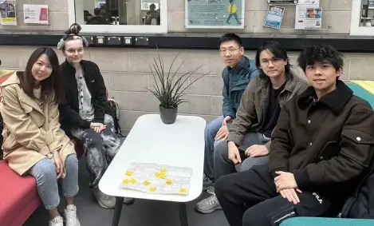
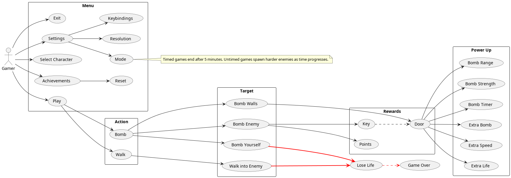
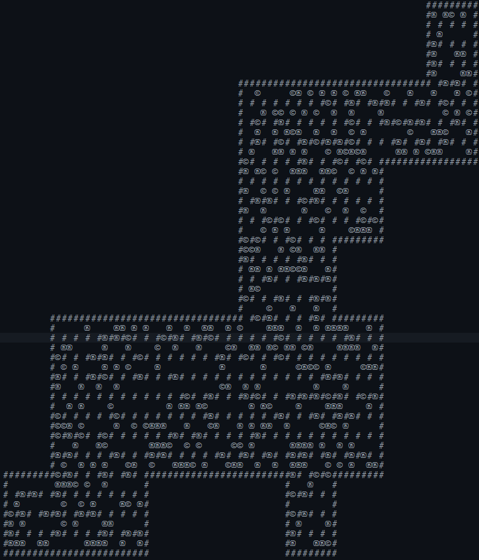
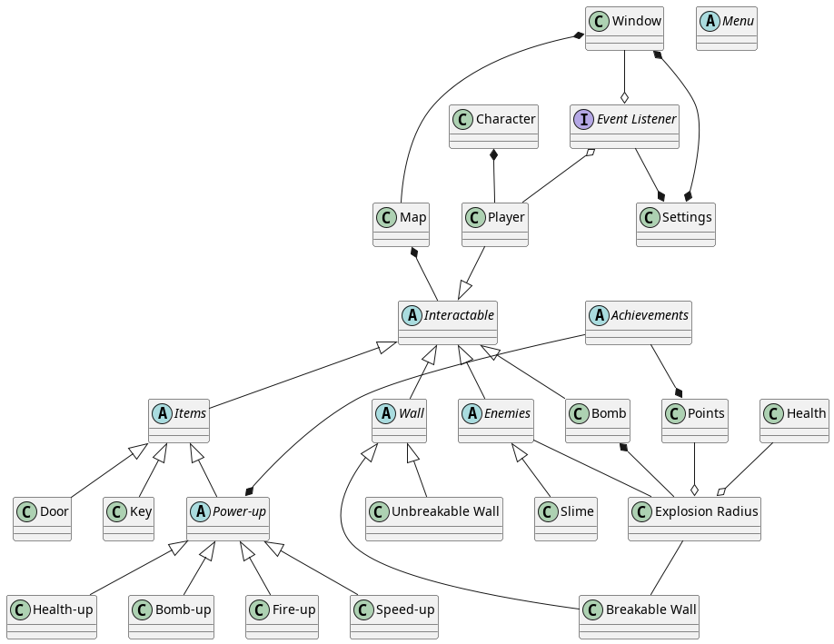
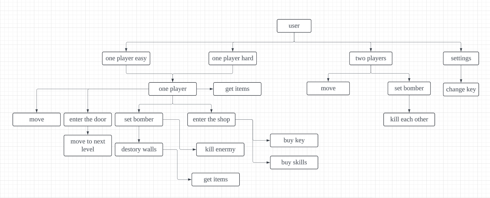
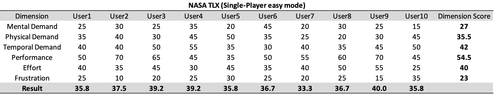
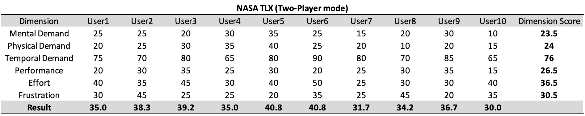
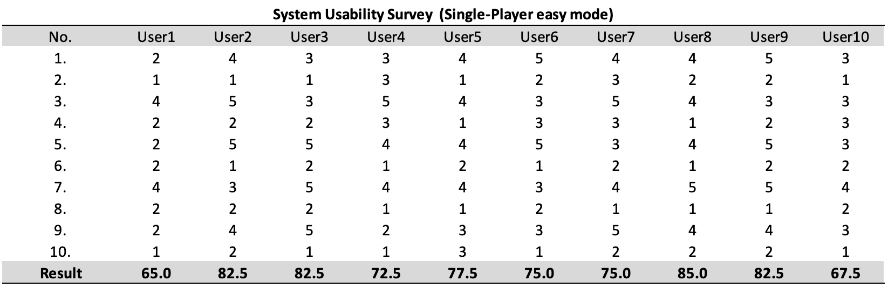
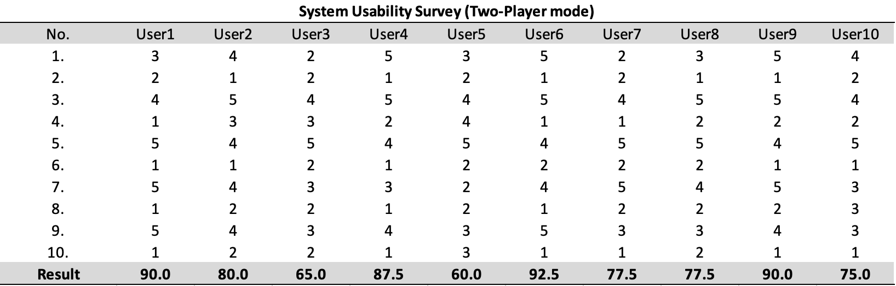

# GROUP 7 💣  BOMBERMAN DUNGEON
[Come and see the amazing experience of Bomberman and Group 7 ! Ｏ(≧口≦)Ｏ](https://www.youtube.com/watch?v=ispMEXkR_t4)

## 1. TEAM



05.02.2024

| MEMBER | EMAIL |
| -----| ----- |
|[Tianyu Liu](https://github.com/bv23164) | [bv23164@bristol.ac.uk](mailto:bv23164@bristol.ac.uk)|
|[Lea Lewis](htps://github.com/le2310al) | [px23592@bristol.ac.uk](mailto:px23592@bristol.ac.uk)|
|[Yiguang Chen](htps://github.com/dcchenyg) | [te23143@bristol.ac.uk](mailto:te23143@bristol.ac.uk)|
|[Zilou Li](htps://github.com/ne23594g) | [ne23594@bristol.ac.uk](mailto:ne23594@bristol.ac.uk)|
|[Zora Chen](htps://github.com/fg23262) | [fg23262@bristol.ac.uk](mailto:fg23262@bristol.ac.uk)|

## 2. INTRODUCTION

Describe your game, what is based on, what makes it novel?
Our game ‘Bomberman Dungeon’ is based on NES and SNES era [Bomberman]( https://en.wikipedia.org/wiki/Bomberman) games. Like it’s namesake our game offers a single player as well as a multiplayer mode in which players clear their way through a grid-based map with the help of their trusty bombs.
Both modes feature the established combat mechanics of bombs being able to blast through breakable walls,  enemies as well as the players themselves. Multiplayer mode largely remains true to its inspiration, offering a two-player death match on a map that dwindles as time progresses. Single player mode however adds two exciting new features. Not only is the player now able to collect coins instead of points, which they can then trade for all-new single or multi-use power ups in the store. But they can also find hidden doors leading deeper into the dungeon increasing the difficulty of gameplay. 

## 3. REQUIREMENTS

### 3.1 Ideation Process

We evaluated 4+ options and decided to develop a game based on [Bomberman]( https://en.wikipedia.org/wiki/Bomberman) as it is a beloved classic that is not devalued by simple 2D graphics. It’s winning formula has remained largely unchanged throughout the years which allows for a variety of possible twists. The popularity of rogue-lite dungeon crawlers like [Hades](https://store.steampowered.com/appp1145360/Hades/) led us to believe that randomised maps and meta progression would be the best course of action, although platform level design such as in [Spelunky]( https://en.wikipedia.org/wiki/Spelunky) was considered. Working through the Stakeholder Strories and Case Specifications helped us explore actions and options that needed implementing in our game.

| Selection of Other Games Considered |
| --- |
| 1. [Pokémon Showdown]( https://pokemonshowdown.com/): A Pokémon battle simulator. The underlying mechanics for this game are too simple to recreate and its enjoyability is overly reliant on monster design and associated nostalgia. Creating balanced and challenging powers would prove too difficult and overshadow other parts of the development process. |
| 2. [Crossy Road]( https://www.crossyroad.com/): An 2.5D endless runner version of the arcade classic [Frogger](https://en.wikipedia.org/wiki/Frogger) in which a chicken must cross the road ad infinitum. Unfortunately, this game has already been recreated in Processing. |
| 3. [Lith]( https://apps.apple.com/us/app/lith/id897768601): An ice slide puzzle game. This game would have required us to hand craft levels, and we were unable to think of a fun twist on the underlying mechanics that hadn’t already been explored in the game. |
| 4. [Downwell]( https://store.steampowered.com/app/360740/Downwell/): A precision platformer in which the player must clear their way of enemies and obstacles while in free fall. As the gameplay is a twist on [Doodle Jump](https://en.wikipedia.org/wiki/Doodle_Jump) and introduces many new mechanics, introducing our own twist would not improve upon the game. |

### 3.2 Early Stage Design

During the week 3 workshop we quickly made a firm decision to go ahead with 'Bomberman Dungeon' and created a rudimentary paper prototype. As we received positive feedback from other groups exploring our prototype, we did not create a second prototype and instead dove straight into creating sprites and other assets to make a digital prototype. The digital prototype aimed to both identify elements in need of implementation as well as provide sprites/assets to aid testing the playability of the game early on.

https://github.com/UoB-COMSM0110/2024-group-7/tree/main/Assets/Videos/prototype.mp4


### 3.3 Stakeholder Stories

>"As a player, I want intuitive and reconfigurable controls." (Physical Impairment)

>"As a player, I want sprites to be distingushable based on shape, not colour." (Visual Impairment)

>"As a player, I want to customise my character."

>"As a player, I want a clear understanding of the game mechanics."

>"As a player, I want achievable yet challenging goals."

>"As a player, I want a straightforward HUD to efffectively strategize."

>"As a player, I want a to keep track of my achievements."

>"As a player, I want replayability and a sense of progression."

>"As a player, I want to explore different game modes and difficultiy levels"

>"As a player, I want to relive the nostalgia of 8-bit games on a CRT."

>"As a player, I want to blow up my friends, even if they are far away."

>"As a developer, I want to gain industry relevant skills"

>"As a developer, I want to work well as part of a team"

>"As a developer, I want to plan my time well and do my fair share of work."

>"As a developer, I want to set a good example for the next cohort."

>"As a marker, I want to experience all core game mechanics within 5 minutes."

>"As a marker, I want to feel compelled to play the game in my own time."

>"As a marker, I want to not be bored by a generic game clone."

### 3.4 Use Case Diagram



Created with PlantUML

### 3.5 CASE SPECIFICATIONS

| Basic Flow | Alternative Flow |
| ----- | ----- |
| | Rebind Keys |
| | Change Character |
| | Choose Mode |
| | Reset Achievements |
| Play Untimed Mode| Exit |
| Explore Dungeon | Walk into Wall|
| Bomb Breakable Wall | <span style="color:red;"> Bomb Yourself: Game over </span> |
| <span style="color:green;"> Find Door </span> | |
| Spot Enemy | <span style="color:red;"> Walk into Enemy: Game Over </span> |
| Bomb Enemy | <span style="color:red;"> Bomb Yourself: Game Over </span> |
| <span style="color:green;"> Receve Points </span> | |
| <span style="color:green;"> Receve Key </span> | |
| Open Door | Explore more ~~or get lost~~ |
| Choose ' Health Up' Power up | Choose other Power Up ~~or none~~ |
| <span style="color:orange;"> Walk into Enemy: Lose Life </span> | Spot Enemy |
| <span style="color:red;"> Bomb Yourself: Game Over </span> | ~~Or be better at the Game~~ |
| Restart with Meta Progression  | Try other Timed Mode instead ~~or exit~~|

## 4. DESIGN

### 4.1 System Architecture

#### 4.1.1 Game Overview

Our game has two modes, single-player mode and two-player mode. The single-player mode is divided into two difficulties. Players can get the key to find the door and enter the next level. Players aim to enter a deeper level; in the two-player mode , two players will compete against each other to defeat each other and achieve victory.

#### 4.1.2 Game world

Bomberman is a two-dimensional game. The game map has destructible and non-destructible walls as well as monsters and various props. It is very playable and has many innovations compared to the original version, such as various skills. The game is generally more casual and entertaining. The game may be a little difficult at the beginning, but as the game progresses, players will become stronger and stronger. Players can not only attack deeper levels in the game, but also enjoy the fun of confrontation with friends.

#### 4.1.3 Game Characters

The game character has some basic values, namely health and movement speed. The bombs placed by the character have bomb range and bomb quantity. These values can be improved by obtaining props in the single-player mode. However, for the sake of fair confrontation, in the two-player mode Fixed value. In addition, there is also the addition of a store, where keys and skills can be purchased, and the required gold coins need to be picked up by the characters on the map.

#### 4.1.4 Game Mechanics

In addition to operating the character to move up, down, left, and right, the player also has two keys. One is to place a bomb. The bomb will explode after a period of time. It can clear the monsters and destructible walls that the player comes into contact with. The health value will also be deducted. The other key is the skill key. Pressing it can trigger powerful effects, such as killing all monsters.
In single-player mode, players need to get the key and enter the door. In the process, they can pick up props and purchase props in the mall. In two-player mode, players need to kill each other to win the game

#### 4.1.5 Game system

The game's prop system can improve the various values ​​of characters and bombs, making players continuously stronger; the monster system is designed with action AI to make monsters move logically; in the combat system, players can place bombs and use skills to kill monsters or destroy them. Wall; in the economic system, players can pick up gold coins, which can be used to buy powerful skills and keys in the store; in the confrontation system, players from both sides can compete, and in order to ensure fairness, the values ​​are constant; Game key positions can be changed in the system settings. The prop system and combat system ensure the strength of the characters, and the economic system adds playability to the game.

#### 4.1.6 Game content

In the simple single-player mode, players need to pick up gold coins to improve the economy and pick up props to improve their own values. The props and gold coins are hidden in destructible walls. Different props can make each game experience different. At the same time, players should also avoid the pursuit of monsters or place bombs to kill monsters. Monsters will continue to move and cause interference to players. When the player accumulates enough gold coins and finds the location of the door, he can go to the store to buy a key and enter the door to enter the next level. If you want to play quickly, you can use accumulated gold coins to purchase powerful skills to speed up the game progress. In the difficult single-player mode, the player's field of view becomes smaller, which increases the difficulty of the game. In the two-player mode, the confrontation range will shrink every 10 seconds. If you step out of this range, your life will be reduced, and the party whose life value reaches zero first will lose.

#### 4.1.7 Progress and Reward

The game's economic system is a reward mode. Players can purchase powerful skills and keys by accumulating gold coins, such as destructible walls that can clear the screen, clear monsters, teleport to the door, super large bomb flames, etc. This can Speed up the progress of the game and enter deeper levels faster. This result will be recorded on the menu, which can satisfy those players who like to challenge themselves. In the confrontation mode, we use the joy of winning when players defeat each other as a reward mode. The unique interaction method and appropriate system prompts make it easy to get started with the game; achievements can be displayed on the desktop, giving users a sense of satisfaction after completing the level. The addition of skills and stores makes the game playable.

#### 4.1.8 Map Generation

The project contains unused code that allows for a grid-based map to be procedurally generated according to specifications such as number and size of rooms. Objects and enemies can be included in the generation process with customisable spawn rates. A data structure containing the status and description of each tile on the map is returned and can be used to update the game state, conduct collision detection, and easily render a select number of game elements to improve game performance.



Legend: # Unbreakable Wall

### 4.2 Class Diagram



Created with PlantUML

### 4.3 Behavioural Diagram



## 5. IMPLEMENTATION

- CHALLENGE 1: Collision Detection
- CHALLENGE 2: Power-Ups
- CHALLENGE 3: Restarting the Game

During the game development process, we encountered numerous challenges. While the implementation of individual features was relatively straightforward, implementing some features required modifications to other already completed sections. These intertwined issues made implementation particularly difficult. Three challenges stood out.
### 5.1 Collision detect
The initial implementation of the collision detection proceeded very smoothly. When the player pressed a movement key, the destination coordinates for the next frame were calculated. Subsequently, the system would traverse lists of rocks and walls to determine if collisions occurred with any of these obstacles. If a collision was detected, the character would not move. After passing the test in the group, we turned to develop other functions.

During the process of adding character enhancement items, issues with collision detection emerged. When the character picked up a speed-enhancing power-up, his movement speed was supposed to increase. This was a simple implementation involving merely an increase in the character's speed attribute. However, we discovered that no matter how much we increased the character's speed, the actual movement speed in the game hardly changed. Later, we found that the problem lay in the performance of the collision detection system.

The initial implementation required traversing a list of hundreds of obstacles in each frame. Completing a full traversal of the list could take upwards of a dozen frames, significantly slowing down character movement. Our optimization strategy involved creating a new auxiliary two-dimensional Boolean array, marking impassable areas on the map as false. Thus, during character movement, it is only necessary to check the Boolean value at the destination coordinates in the auxiliary array to determine collision presence.

However, by the time these issues were addressed, we had already completed the random map generation and hiding power-ups behind breakable rocks. Modifying the collision detection also required changes to these existing functionalities, substantially increasing the workload. Fortunately, the implementation was highly successful, enabling smooth character movement in response to player commands.

### 5.2 Power-ups
This implementation was initially very challenging. The first problem was ensuring that the same rock was not chosen repeatedly for hiding different items during random selection. The second issue involved displaying the items correctly once the rocks were destroyed.

The solution to the first problem involved using a hash set. An index was generated for each item and stored in the hash set, indicating that the item was hidden behind a specific rock. Due to the random and unique nature of hash sets, it prevented any item from being hidden behind the same rock twice.

The second problem seemed straightforward: items simply needed to be displayed when their corresponding rocks were destroyed. However, the existing method for destroying rocks did not support adding such a feature and even required modifications to the code related to bombs and flames. Finally, we introduced an intermediate state before a rock was destroyed, and added a Boolean status to the rock class indicating whether it stored an item. When the rock was in this intermediate state, the item's method was called, and based on the properties of the rock, it was determined which type of item would be generated.

### 5.3 Restart the game
Toward the end of game development, we needed to implement a restart feature to ensure that players could replay the game after returning to the main menu. This involved regenerating the map and resetting the character's enhancement states. The challenge arose because the generation of the map, enemies, and the hiding of enhancement items were all done in the setup section of Processing, where statements are executed only once. Figuring out how to correctly reset the game within the draw loop became a significant issue.

To implement this functionality, it was necessary to adjust a vast amount of code related to the map, enemies, items, and players. We wrote a separate reset method for each related list (such as rocks, enemies, each type of item, etc.) and executed these methods when the player clicked the button to enter the game.

For instance, regarding breakable rocks, first clear the rocks list at the start and then re-populate it with randomly placed rocks. Subsequently, the collision detection array must be updated according to the new rock placements. Finally, items are added to this new list of rocks. The interdependence of these lists presents considerable challenges in game development.

The volume of code added was considerable and required a significant amount of time. This approach ensured that every aspect of the game could be reset properly, allowing for a seamless experience when restarting the game.

## 6. EVALUATION

We invited a total of 10 users to participate in game testing to understand the navigability, usability, and appropriate difficulty level of our game. We hope to improve the game through user feedback, making it both challenging and enjoyable.

### 6.1 Qualitative
We used the Think Aloud method to perform qualitative analysis during our game testing. We invited ten users to join this test, and half of them had related playing experience, and rest of them are first time playing bomber man. For the test, users are asked to verbalize their thoughts, feeling and experiences while playing the game. 

Based on the results of the qualitative evaluation, we have organized several dimensions for improvement: First, player instruction. We have added simply operating instructions on the main page to help novice users quickly understand the basic rules and control method of the game, so that they can easily to get started. Second, movement fluency of the character in the game. We have enhanced the collision detection mechanism to avoid inaccuracies that may cause the risk of unnatural movement, so that we can ensuring the movement action of the character including turning, stopping, and acceleration are smooth and no delay. Furthermore, we ensured a proper balance between the number of items and enemies to maintain an appropriate level of game challenge through multiple test plays by our team members.

Regarding the difficulty levels in the single-player mode, we introduced a hard mode to offer greater challenges, meeting the needs of experienced players for higher difficulty and more complex strategies while retaining an easy mode to allow novice players to start more comfortably and reduce beginner frustration.

Additionally, testers provided not only dimensions for improvement but also positive feedback. Users generally found the two-player mode to be very interesting, innovative, and exciting, marking a significant difference from the traditional Bomberman game. Besides, the shop design in the single-player mode was also highly praised. And through implementing various skills also further enhances the player experience.

### 6.2 Quantitative

In terms of quantitative evaluation, users had to fill out forms for NASA-TLX and SUS after they completed experienced the whole game including single-player mode and two-play model.

In NASA-TLX, we analyse the NASA-TLX scores for single-player and two-player modes, the Wilcoxon Significance Test at a 95% confidence interval revealed no significant difference as well(W test statistic = 15). However, take a detailed look across these six dimensions, indiciating the scores between these two modes are quite similar for Mental Demand, Physical Demand, Effort, and Frustration. We could have a conclusion that users are required to put a considerable amount of effort while playing the game without experiencing excessive mental or physical burden. Additionally, low to moderate frustration scores show that most players do not feel overly discouraged by the game.

It is worth noting that Temporal Demand is significantly higher in two-player mode compared to single-player mode, revealing that time pressure is obvious in the two-player mode. This is making sense because there is a countdown timer in two-player mode, users have to response quickly within a limited timeframe. This is also reflected in the Performance aspect, where the added time pressure and competitive element of playing against other players may more readily impact performance.




In SUS, the average score for single-player mode and two-player mode are 76.5 and 79.5, respectively, both over the general usability benchmark of 68. Moreover, most of the users’ scores are all above this threshold, indicating that users gave positive feedback on usability. We also conducted a Wilcoxon Significance Test to evaluate if there is a significant difference in usability between these two modes. The resulting W test statistic is 21.0. According to the Wilcoxon critical values table, it does not denote a significant difference at a 95% confidence level for a sample size N=10. This outcome aligns with our expectations, the reason is that the operation methods between the different modes are very similar, with only game design variations, thus not significantly impacting usability assessments.





### 6.3 Code Testing
We used Processing for our game development software, which has limited support for unit testing. So our code testing has mainly focused on user testing and developer testing, which our team member conducted playtesting while developed a new feature, and also executed countless playtests upon the completion of the game.

For the user testing, we employed the Think Aloud method throughout the development phase to gather user feedback and optimize the game based on these insights. In the subsequent phase, we collected user opinions through quantitative questionnaires. The results indicated that our game performs well in terms of usability, and the workloads were not burdensome for players. We also received positive feedback regarding the game experience and challenges.

## 7. PROCESS

### 7.1 Teamwork
Our team of five members deeply engaged in both game design and coding throughout this project. We operated without clear role assignments, but each member contributed their strengths effectively, ensuring the success of our endeavor.

During the brainstorming phase, Lea catalyzed our creativity with a plethora of innovative ideas, inspiring the team significantly. Tianyu then proposed the idea that resonated with all of us, ultimately becoming the foundation of our game.

In the realm of game design, Lea spearheaded the construction of the fundamental framework, laying the groundwork with initial code and basic art resources. Zilou contributed numerous ideas to enhance our game, including the implementation of a PvP mode and various skills.

During development, Yiguang, Zilou, and Zora were primarily responsible for coding the game logic, while Tianyu focused on UI and interface design. Notably, Zilou refactored our codebase to improve readability, and Yiguang enhanced visual effects for a more aesthetically pleasing experience.

In the documentation phase and the creation of our demo video, Lea recorded our initial project discussions, which Tianyu subsequently organized and edited. Yiguang, Zilou, and Zora contributed to the remaining written content, with Yiguang also producing the demo video.

We unanimously acknowledge the indispensable contributions of each team member, recognizing that the absence of any individual would have made the project significantly more challenging.

### 7.2 TOOLS

- [Slack](https://bombermandungeon.slack.com/ssb/redirect) Served as our initial Instant messager, but we seldom use it then,
- [Jira](https://bomberman-dungeon.atlassian.net/jira/software/projects/BOM/boards/1) We employed Jira as a Kanban board to monitor our progress effectively.

- Wechat: Serving as our primary instant messenger, Wechat facilitated concise communication for tasks such as bug reporting, meeting invitations, feature notifications, and code reviews.
- IntelliJ IDEA: As our project initially began in Java and was later converted into Processing, IntelliJ IDEA served as our primary development environment for coding.
- Git: Utilizing Git for version control, with the remote repository hosted on Github, we followed a workflow where new features were developed in independent branches before undergoing code review by other team members and subsequently merging into the main branch.
- 
### 7.3 Challenges and Resolutions
Despite our collective efforts, challenges and conflicts arose throughout our teamwork. There were discrepancies regarding scheduling preferences, with some advocating for completing tasks before the Easter holiday while others favored working during the holiday period. Additionally, although the final game was well-received overall, not every team member was entirely satisfied, as certain deviations from our initial design draft occurred. The introduction of new features during the development phase also sparked discussions within the team, with decisions not always reaching unanimous agreement. However, despite these challenges, we successfully completed the project.

### 7.3 Code Style

```java
public class Bomberman extends PApplet {
   boolean play=true;

   public void settings() {
      size(width, height);

   }
}
```

## 8. CONCLUSION
In conclusion, we based our game on the iconic Bomberman, but infused lots of innovative ideas to enrich the gaming experience throughout our development process. For example, in the single-player mode, the primary goal for players is to enter as more as possible round of the game by getting the key to enter the door. So we innovatively introduced coins, shops and five special skills, players can buy skills in the shop by collocting coins to achieve higher achievements. In the two-player mode, the main purpose for player is to eliminate the opponent to win the game. To increase the tension and excitement of the game, we creatively added a countdown feature to narrow the combat zone. All these innovations not only set our game apart from the traditional Bomberman but also enhance the game’s enjoyment and novelty.  

During the process of the game development, to align with the agile principles, we used Jira to assign tasks and effectively monitor team progress. We communicated in the real time via WeChat. And code updated and maintenance were conducted through GitHub.

However, we encounted several challenges while we were developing our game. While the implementation of individual features was relatively straightforward, implementing some features required modifications to other already completed sections. These intertwined issues made implementation particularly difficult. Collison detect, power-ups and game restarts are the main challenges that we faced. Nevertheless, due to our exceptional teamwork, we successfully overcame all obstacles and significantly enhanced team members’ game development capabilitie.

Moreover, to ensure the game was user-oriented, in the later stages of game development, we collected player feedback through the Think Aloud method and quantitative survey, then we optimized our game based on those constructive comments.

To sum up, we are all proud of the game we have developed. In terms of innovation, fun, and usability, we believe our game has reached an impressive level. However, due to the time limit, there are some feeatures that could be optimized and impoved in the future, For instance, a feature where players would return to the starting position and lose all items and skills they had upon death could make the game more challanging. Additionally, the bomb’s firepower and timing of their explosions may be affected by nearby explosives, so that it would increase the thill and competition in the two-player mode.


