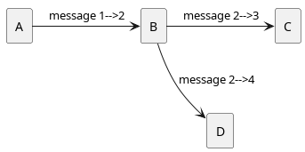

# GROUP 7 💣  BOMBERMAN DUNGEON

## 1. TEAM
<center>
<figure>
    
    <figcaption>05.02.2024</figcaption>
</figure>

| MEMBER | CONTACT |
| -----| ----- |
|[Tianyu Liu](https://github.com/bv23164) | [bv23164@bristol.ac.uk](mailto:bv23164@bristol.ac.uk)|
|[Lea Lewis](htps://github.com/le2310al) | [px23592@bristol.ac.uk](mailto:px23592@bristol.ac.uk)|
|[Yiguang Chen](htps://github.com/dcchenyg) | [te23143@bristol.ac.uk](mailto:te23143@bristol.ac.uk)|
|[Zilou Li](htps://github.com/ne23594g) | [ne23594@bristol.ac.uk](mailto:ne23594@bristol.ac.uk)|
|[Zora Chen](htps://github.com/fg23262) | [fg23262@bristol.ac.uk](mailto:fg23262@bristol.ac.uk)|
</center>

## 2. INTRODUCTION

Our Bomberman game mainly revolves around two game modes: In the single-player mode, the player enters the next round of the game by getting the key to enter the door, and the player aims to pass more levels. We have innovatively added various props, shops and skills to the single-player mode, and set up two difficulties to make the game more playable. In the multiplayer game mode, players must try to eliminate each other and win the game. In order to increase the excitement of the game, a countdown function is creatively added to narrow the scope of the confrontation between the two parties. Gameplay involves strategically placing bombs that explode in multiple directions after a certain time to destroy obstacles and kill enemies and other players. Players can pick up various power-ups, giving them benefits such as greater explosive power or the ability to place more bombs at once. Players will be killed if they come into contact with an enemy or get caught in a bomb explosion (including their own), requiring players to be careful about where they place their bombs.

## 3. REQUIREMENTS

The group evaluated 5+ options and decided to develop a game based on bomberman as it is a beloved classic that is not devalued by simple 2D graphics. The popularity of roguelite dungeon crawlers like [Hades](https://store.steampowered.com/appp1145360/Hades/) led us to believe that they wuld make a fun twist to Bomberman.

### 3.1 Use Case Diagram

<center>
<figure>
    
</figure>
</center>

### 3.2 User Stories

>"As a player, I want intuitive and reconfigurable controls." (Physical Impairment)

>"As a player, I want sprites to be distingushable based on shape, not colour." (Visual Impairment)

>"As a player, I want to customise my character."

>"As a player, I want a clear understanding of the game mechanics."

>"As a player, I want achievable yet challenging goals."

>"As a player, I want a straightforward HUD to efffectively strategize."

>"As a player, I want a to keep track of my achievements."

>"As a player, I want replayability and a sense of progression."

>"As a player, I want to explore different game modes and difficultiy levels"

>"As a player, I want to relive the nostalgia of 8-bit games on a CRT."

>"As a player, I want to blow up my friends, even if they are far away."

>"As a developer, I want to gain industry relevant skills"

>"As a developer, I want to work well as part of a team"

>"As a developer, I want to plan my time well and do my fair share of work."

>"As a developer, I want to set a good example for the next cohort."

>"As a marker, I want to experience all core game mechanics within 5 minutes."

>"As a marker, I want to feel compelled to play the game in my own time."

>"As a marker, I want to not be bored by a generic game clone."
>

### 3.3 Early Stages Design

We first used brainstorming methods to come up with some ideas in the group, and then discussed these ideas. We conducted in-depth discussions mainly on technical issues, playability issues, innovative issues and reliability issues, and analyzed the innovative points of each idea. and challenges, and finally chose two options.

### 3.4 Ideation Process

We used the methods we learned in class to make props to demonstrate the game, and drew a prototype of the game. After many discussions and game deductions, we had a relatively clear understanding of our project.Then we divided the tasks and used project management tools such as stack and jira.Finally, we started the project development, demo recording and other work.

[//]: # (### STAKEHOLDERS)
[//]: # (- Players)
[//]: # (- Developers)
[//]: # (- Markers)

### 3.5 CASE SPECIFICATIONS

<center>

| Basic Flow | Alternative Flow |
| ----- | ----- |
| | Rebind Keys |
| | Change Character |
| | Choose Mode |
| | Reset Achievements |
| Play Untimed| Exit |
| Explore Dungeon | Walk into Wall|
| Bomb Breakable Wall | <span style="color:red;"> Bomb Yourself: Game over </span> |
| <span style="color:green;"> Find Door </span> | |
| Spot Enemy | <span style="color:red;"> Walk into Enemy: Game Over </span> |
| Bomb Enemy | <span style="color:red;"> Bomb Yourself: Game Over </span> |
| <span style="color:green;"> Receve Points </span> | |
| <span style="color:green;"> Receve Key </span> | |
| Open Door | Explore more ~~or get lost~~ |
| Choose ' Health Up' Power up | Choose other Power Up ~~or none~~ |
| <span style="color:orange;"> Walk into Enemy: Lose Life </span> | Spot Enemy |
| <span style="color:red;"> Bomb Yourself: Game Over </span> | ~~Or be better at the Game~~ |
| Restart with Meta Progression  | Try other Mode instead ~~or exit~~|

</center>

[//]: # (### RREFLECTION)
[//]: # (This exercise has helped us explore actions and options that need )
[//]: # (to be implemented within our game.)

## 4. DESIGN

### 4.1 System Architecture

#### 4.1.1 Game Overview

Our game has two modes, single-player mode and two-player mode. The single-player mode is divided into two difficulties. Players can get the key to find the door and enter the next level. Players aim to enter a deeper level; in the two-player mode , two players will compete against each other to defeat each other and achieve victory.

#### 4.1.2 Game world

Bomberman is a two-dimensional game. The game map has destructible and non-destructible walls as well as monsters and various props. It is very playable and has many innovations compared to the original version, such as various skills. The game is generally more casual and entertaining. The game may be a little difficult at the beginning, but as the game progresses, players will become stronger and stronger. Players can not only attack deeper levels in the game, but also enjoy the fun of confrontation with friends.

#### 4.1.3 Game Characters

The game character has some basic values, namely health and movement speed. The bombs placed by the character have bomb range and bomb quantity. These values can be improved by obtaining props in the single-player mode. However, for the sake of fair confrontation, in the two-player mode Fixed value. In addition, there is also the addition of a store, where keys and skills can be purchased, and the required gold coins need to be picked up by the characters on the map.

#### 4.1.4 Game Mechanics

In addition to operating the character to move up, down, left, and right, the player also has two keys. One is to place a bomb. The bomb will explode after a period of time. It can clear the monsters and destructible walls that the player comes into contact with. The health value will also be deducted. The other key is the skill key. Pressing it can trigger powerful effects, such as killing all monsters.
In single-player mode, players need to get the key and enter the door. In the process, they can pick up props and purchase props in the mall. In two-player mode, players need to kill each other to win the game

#### 4.1.5 Game system: Introduce various systems in the game, such as combat system, mission system, economic system, etc. Explain how systems work and relate to each other.

The game's prop system can improve the various values ​​of characters and bombs, making players continuously stronger; the monster system is designed with action AI to make monsters move logically; in the combat system, players can place bombs and use skills to kill monsters or destroy them. Wall; in the economic system, players can pick up gold coins, which can be used to buy powerful skills and keys in the store; in the confrontation system, players from both sides can compete, and in order to ensure fairness, the values ​​are constant; Game key positions can be changed in the system settings. The prop system and combat system ensure the strength of the characters, and the economic system adds playability to the game.

#### 4.1.6 Game content

In the simple single-player mode, players need to pick up gold coins to improve the economy and pick up props to improve their own values. The props and gold coins are hidden in destructible walls. Different props can make each game experience different. At the same time, players should also avoid the pursuit of monsters or place bombs to kill monsters. Monsters will continue to move and cause interference to players. When the player accumulates enough gold coins and finds the location of the door, he can go to the store to buy a key and enter the door to enter the next level. If you want to play quickly, you can use accumulated gold coins to purchase powerful skills to speed up the game progress. In the difficult single-player mode, the player's field of view becomes smaller, which increases the difficulty of the game. In the two-player mode, the confrontation range will shrink every 10 seconds. If you step out of this range, your life will be reduced, and the party whose life value reaches zero first will lose.

#### 4.1.7 Progress and Reward

The game's economic system is a reward mode. Players can purchase powerful skills and keys by accumulating gold coins, such as destructible walls that can clear the screen, clear monsters, teleport to the door, super large bomb flames, etc. This can Speed up the progress of the game and enter deeper levels faster. This result will be recorded on the menu, which can satisfy those players who like to challenge themselves. In the confrontation mode, we use the joy of winning when players defeat each other as a reward mode.

#### 4.1.8 Other features

The unique interaction method and appropriate system prompts make it easy to get started with the game; achievements can be displayed on the desktop, giving users a sense of satisfaction after completing the level. The addition of skills and stores makes the game playable.

### 4.2 Class Diagrams

<center>
<figure>
    
</figure>
</center>

### 4.3 Behavioural diagrams

<center>
<figure>
    
</figure>
</center>

[//]: # (### communication Diagrams)

[//]: # (<center>)
[//]: # (<figure>)
[//]: # (    )
[//]: # (</figure>)
[//]: # (</center>)

[//]: # (### RREFLECTION)

[//]: # (This exercise has helped us structure our codeand assgign tasks )
[//]: # (within the group.)

## IMPLEMENTATION

- CHALLENGE 1:
- CHALLENGE 2:
- CHALLENGE 3:

## EVALUATION

- QUALITATIVE:
- QUANTITATIVE:
- TESTING:

## 7.PROCESS
### 7.1 Teamwork
Our team of five members deeply engaged in both game design and coding throughout this project. We operated without clear role assignments, but each member contributed their strengths effectively, ensuring the success of our endeavor.

During the brainstorming phase, Lea catalyzed our creativity with a plethora of innovative ideas, inspiring the team significantly. Tianyu then proposed the idea that resonated with all of us, ultimately becoming the foundation of our game.

In the realm of game design, Lea spearheaded the construction of the fundamental framework, laying the groundwork with initial code and basic art resources. Zilou contributed numerous ideas to enhance our game, including the implementation of a PvP mode and various skills.

During development, Yiguang, Zilou, and Zora were primarily responsible for coding the game logic, while Tianyu focused on UI and interface design. Notably, Zilou refactored our codebase to improve readability, and Yiguang enhanced visual effects for a more aesthetically pleasing experience.

In the documentation phase and the creation of our demo video, Lea recorded our initial project discussions, which Tianyu subsequently organized and edited. Yiguang, Zilou, and Zora contributed to the remaining written content, with Yiguang also producing the demo video.

We unanimously acknowledge the indispensable contributions of each team member, recognizing that the absence of any individual would have made the project significantly more challenging.

### 7.2 TOOLS

- [Slack](https://bombermandungeon.slack.com/ssb/redirect) Served as our initial Instant messager, but we seldom use it then,
- [Jira](https://bomberman-dungeon.atlassian.net/jira/software/projects/BOM/boards/1) We employed Jira as a Kanban board to monitor our progress effectively.

- Wechat: Serving as our primary instant messenger, Wechat facilitated concise communication for tasks such as bug reporting, meeting invitations, feature notifications, and code reviews.
- IntelliJ IDEA: As our project initially began in Java and was later converted into Processing, IntelliJ IDEA served as our primary development environment for coding.
- Git: Utilizing Git for version control, with the remote repository hosted on Github, we followed a workflow where new features were developed in independent branches before undergoing code review by other team members and subsequently merging into the main branch.
### 7.3 Challenges and Resolutions
Despite our collective efforts, challenges and conflicts arose throughout our teamwork. There were discrepancies regarding scheduling preferences, with some advocating for completing tasks before the Easter holiday while others favored working during the holiday period. Additionally, although the final game was well-received overall, not every team member was entirely satisfied, as certain deviations from our initial design draft occurred. The introduction of new features during the development phase also sparked discussions within the team, with decisions not always reaching unanimous agreement. However, despite these challenges, we successfully completed the project.

### CODE STYLE

```java
public class Bomberman extends PApplet {
   boolean play=true;

   public void settings() {
      size(width, height);

   }
}
```

### MEMBERS

<center>

| MEMBER | ROLE | CONTRIBUTIONS |
| -----| ----- | -----|
| Tianyu Liu | | |
| Lea Lewis | | |
| Yiguang Chen | | |
| Zilou Li | | |
| Zora Chen | | |

</center>

## CONCLUSION

<center>

| LESSONS | CHALLENGES | FUTURE WORK |
| -----| ----- | -----|

</center>
