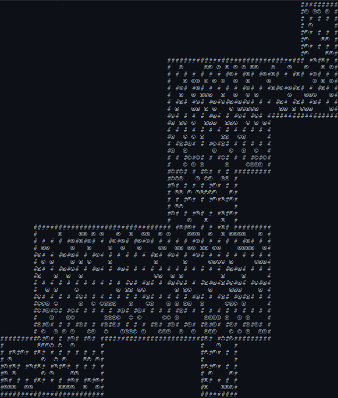

# GROUP 7 💣  BOMBERMAN DUNGEON

## 🎥 PROMOTIONAL VIDEO

[](https://www.youtube.com/watch?v=ispMEXkR_t4)

## TABLE OF CONTENTS

- [1. TEAM](#1.-TEAM)
- [2. INTRODUCTION](#2.-INTRODUCTION)
- [3. REQUIREMENTS](#3.-REQUIREMENTS)
- [4. DESIGN](#4.-DESIGN)
- [5. IMPLEMENTATION](#5.-IMPLEMENTATIONs)
- [6. EVALUATION](#6.-EVALUATION)
- [7. PROCESS](#7.-PROCESS)
- [8. CONCLUSION](#8.-CONCLUSION)

## 1. TEAM


05.02.2024

| MEMBER | EMAIL |
| -----| ----- |
|[Tianyu Liu](https://github.com/bv23164) | [bv23164@bristol.ac.uk](mailto:bv23164@bristol.ac.uk)|
|[Lea Lewis](htps://github.com/le2310al) | [px23592@bristol.ac.uk](mailto:px23592@bristol.ac.uk)|
|[Yiguang Chen](htps://github.com/dcchenyg) | [te23143@bristol.ac.uk](mailto:te23143@bristol.ac.uk)|
|[Zilou Li](htps://github.com/ne23594g) | [ne23594@bristol.ac.uk](mailto:ne23594@bristol.ac.uk)|
|[Zora Chen](htps://github.com/fg23262) | [fg23262@bristol.ac.uk](mailto:fg23262@bristol.ac.uk)|

## 2. INTRODUCTION

Our game *Bomberman Dungeon* is based on NES and SNES era [Bomberman]( https://en.wikipedia.org/wiki/Bomberman) games. Like it’s namesake our game offers a single player as well as a multiplayer mode in which players clear their way through a grid-based map with the help of their trusty bombs.
Both modes feature the established combat mechanics of bombs being able to blast through breakable walls,  enemies as well as the players themselves. Multiplayer mode largely remains true to its inspiration, offering a two-player death match on a map that dwindles as time progresses. Single player mode however adds two exciting new features. Not only is the player now able to collect coins instead of points, which they can then trade for all-new single or multi-use power ups in the store. But they can also find hidden doors leading deeper into the dungeon. 

## 3. REQUIREMENTS

### 3.1 Ideation Process

We evaluated 4+ options and decided to develop a game based on [Bomberman]( https://en.wikipedia.org/wiki/Bomberman) as it is a beloved classic that is not devalued by simple 2D graphics. It’s winning formula has remained largely unchanged throughout the years which allows for a variety of possible twists. The popularity of rogue-lite dungeon crawlers like [Hades](https://store.steampowered.com/appp1145360/Hades/) led us to believe that randomised maps and meta progression would be the best course of action, although platform level design such as in [Spelunky]( https://en.wikipedia.org/wiki/Spelunky) was considered. Working through the Stakeholder Strories and Case Specifications helped us explore actions and options that needed implementing in our game.

| Selection of Other Games Considered |
| --- |
| 1. [Pokémon Showdown]( https://pokemonshowdown.com/): A Pokémon battle simulator. The underlying mechanics for this game are too simple to recreate and its enjoyability is overly reliant on monster design and associated nostalgia. Creating balanced and challenging powers would prove too difficult and overshadow other parts of the development process. |
| 2. [Crossy Road]( https://www.crossyroad.com/): An 2.5D endless runner version of the arcade classic [Frogger](https://en.wikipedia.org/wiki/Frogger) in which a chicken must cross the road ad infinitum. Unfortunately, this game has already been recreated in Processing. |
| 3. [Lith]( https://apps.apple.com/us/app/lith/id897768601): An ice slide puzzle game. This game would have required us to hand craft levels, and we were unable to think of a fun twist on the underlying mechanics that hadn’t already been explored in the game. |
| 4. [Downwell]( https://store.steampowered.com/app/360740/Downwell/): A precision platformer in which the player must clear their way of enemies and obstacles while in free fall. As the gameplay is a twist on [Doodle Jump](https://en.wikipedia.org/wiki/Doodle_Jump) and introduces many new mechanics, introducing our own twist would not improve upon the game. |

### 3.2 Early Stage Design

During the week 3 workshop we quickly made a firm decision to go ahead with 'Bomberman Dungeon' and created a rudimentary paper prototype. As we received positive feedback from other groups exploring our prototype, we did not create a second prototype and instead dove straight into creating sprites and other assets to make a digital prototype. The digital prototype aimed to both identify elements in need of implementation as well as provide sprites/assets to aid testing the playability of the game early on.

[]()


### 3.3 Stakeholder Stories

<details open>
<summary> As a Player: </summary>  
   
>"I want intuitive and reconfigurable controls." (Physical Impairment)

>"I want sprites to be distingushable based on shape, not colour." (Visual Impairment)

>"I want to customise my character."

>"I want a clear understanding of the game mechanics."

>"I want achievable yet challenging goals."

>"I want a straightforward HUD to efffectively strategize."

>"I want a to keep track of my achievements."

>"I want replayability and a sense of progression."

>"I want to explore different game modes and difficultiy levels"

>"I want to relive the nostalgia of 8-bit games on a CRT."

>"I want to blow up my friends, even if they are far away."
</details>
<details open>
<summary> As a Developer: </summary>  

>"I want to gain industry relevant skills"

>"I want to work well as part of a team"

>"I want to plan my time well and do my fair share of work."

>"I want to set a good example for the next cohort."
</details>
<details open>
<summary> As a Marker: </summary>  

>"I want to experience all core game mechanics within 5 minutes."

>"I want to feel compelled to play the game in my own time."

>"I want to not be bored by a generic game clone."
</details>

### 3.4 Use Case Diagram

<center>
   


</center>

Created with PlantUML

### 3.5 CASE SPECIFICATIONS

| Basic Flow | Alternative Flow |
| ----- | ----- |
| | Rebind Keys |
| | Change Character |
| | Choose Mode |
| | Reset Achievements |
| Play Untimed Mode| Exit |
| Explore Dungeon | Walk into Wall|
| Bomb Breakable Wall | <span style="color:red;"> Bomb Yourself: Game over </span> |
| <span style="color:green;"> Find Door </span> | |
| Spot Enemy | <span style="color:red;"> Walk into Enemy: Game Over </span> |
| Bomb Enemy | <span style="color:red;"> Bomb Yourself: Game Over </span> |
| <span style="color:green;"> Receve Points </span> | |
| <span style="color:green;"> Receve Key </span> | |
| Open Door | Explore more ~~or get lost~~ |
| Choose ' Health Up' Power up | Choose other Power Up ~~or none~~ |
| <span style="color:orange;"> Walk into Enemy: Lose Life </span> | Spot Enemy |
| <span style="color:red;"> Bomb Yourself: Game Over </span> | ~~Or be better at the Game~~ |
| Restart with Meta Progression  | Try other Timed Mode instead ~~or exit~~|

## 4. DESIGN

### 4.1 Class Diagram


Created with PlantUML

### 4.2 Discarded System Architecture

The main `GameLoop` class outsources most functionality to other classes such as dedicated Event Listener classes `Keyboard` and `Mouse` and the `Assets` class which at present loads fonts and sprites. The `Settings` class aims to provide a centralised place to adjust values influencing the game state such as Boolean Variables representing whether powerups have been acquired. 

#### 4.2.1 Map & Tile Class

When called, `Map.generate()` populates a 2D array in the main class with Instances of `Tile` that each contain information on the type of object placed on the map as well as its position and sprite. At present the only objects spawned are floor, rock and inner as well as outer wall. Map RNG can not only be customized by defining the size and number of rooms but also by including additional types of objects or further specialising present objects. Iterating over rocks could therefore assign them items such as coins or powerups to hide. As the map exceeds the screen size, `Map.render()` saves resources by only addressing tiles contained within the game window. 



Legend: # Unbreakable Wall

#### 4.2.2 Collision & Player Class

The player may get stuck in ‘dead corners’ of junctions between inner walls if they over- or undershoot the centre of the junction while attempting to make a turn. `Collision.check()` is fed a snapshot of the current user input due to the discrepancy between the game refresh rate and the speed at which the event listener registers keypresses. The function sanitizes user input,  and cascades  into further functions that assign the attempted movement to one of 12 categories which either allow for a direct execution on movement if no collision is involved or task the autopilot to reposition the player to the nearest junction prior to execution if the centre has been just barely over- or undershot. If the tiles between the player and their goal are of type ‘floor’, then no collision has occurred. In order to traverse the map, player movement affects translation of the map along a 2D axis, displacing it within the display window, making the player appear stationary.

### 4.3 Present System Architecture

#### 4.3.1 Main Menu

Upon entering the world of  ‘Bomberman Dungeon’ the player can choose between one of three game modes, single player easy, single player hard and two player duel or use the settings menu change the key bindings. In hard mode, the player's FOV is reduced whereas in duel mode the map shrinks every 10 seconds. 

#### 4.3.2 Map

The map is based on 30x30px tiles which the player views top-down. It consists of non-destructible walls enclosing the dungeon as well as additional walls placed in a checkerboard pattern. In multiplayer mode map RNG is limited to  breakable rocks. In singleplayer mode rocks and enemies as well as two shops are randomly distributed throughout the map. Rocks furthermore have the potential to hide powerups, coins, keys, and the door until they are destroyed. The door requires a key to open and leads to the next level. 

#### 4.3.3 Player and Combat System

The player is attributed with a modifiable health state, movement speed and coin inventory. They are equipped with bombs that blast away enemies and breakable rocks both horizontally and vertically. The players own bombs however can also cause them to lose a health state. In multiplayer mode this also extends to the enemy player.

#### 4.3.5 Powerups and Skills

The player can obtain classic powerups such as ‘speedup’ which increases player speed, ‘bombup’ for an increased bomb carrying capacity, ‘fireup’ for an increased bomb range and ‘healthup’ for increased player health.
5 novel single use skills can be purchased with coins in the shop. ‘RemoveAllRocks’  removes all breakable rocks on the level, whereas ‘KillAllEnemies’ removes all enemies and ‘MoveToTheDoor’ teleports the player to the door. ‘VerticalFlames’ and ‘RoundFlames’ further increase the destructive range of bombs.

## 5. IMPLEMENTATION

During the development process, we encountered numerous challenges. While the implementation of individual features was relatively straightforward, integrating them often required modifications to the existing code base. Three challenges stood out.

### 5.1 Smooth Player Movement

Prior to populating the map with additional items, collisions were detected by comparing the players goal coordinates with the coordinates of all walls and rocks present.
Adding new items initially did not affect framerates, however once the powerup increasing player speed was introduced, we were baffled to see that player movement would not increase regardless of the chosen speed value. Once we identified the culprit to be a lack of optimization of collision detection, we were able to tackle this challenge. Our solution took the form of a 2D Boolean Array that marks impassable areas on the map as false. Subsequently goal coordinates must now only be checked against their corresponding Boolean value within the array.

However, by the time this issue had been addressed, we had already implemented map RNG and the association of powerups with breakable rocks. Modifying the collision detection therefore also required changes to the aforementioned features, substantially increasing the workload. 

### 5.2 Power-ups

Adding powerups to the game revealed itself to be a compound of two challenges.

The first challenge involved ensuring that the same rock was not repeatedly chosen to hide different powerups during random map generation. This was solved by first assigning each item a unique index and then storing the index within a Hash Set to indicate that the item was hiding behind a specific rock. Due to the random and unique nature of Hash Set values, this approach prevented an item from being hidden behind the same rock twice.

The second challenge involved displaying the correct item once their associated rocks were destroyed. Unfortunately, the existing approach to destroying rocks did not support adding this feature requiring modifications to both classes for bombs and flames. We chose to introduce an intermediate state between the destruction and disappearance of the rock. Furthermore, we added a Boolean flag to the rock class indicating whether or not it stored an item. When the rock was put in the intermediate state, its other properties determined which item to generate, and an instance of the item was created.


### 5.3 Resetting the Game State

Nearing completion of the game, we were missing a feature that would allow the player to reset the map and any progress made. Unfortunately map RNG was bound to the setup section of Processing, where statements are executed only once at the start of the game.

Implementing this feature required adjustments to vast amounts of code pertaining to the map, enemies, items, and players. We ended up writing individual reset functions for each class, which were executed upon starting the game.

For instance, in order to reset breakable rocks, the map must first be cleared of and repopulated with rocks. Then the collision detection array must be updated according to the placement of the new rocks. Finally, new items need to be associated with the rocks.

## 6. EVALUATION

We invited a total of 10 users to participate in user testing in order to gain a better understanding of the functionality, usability, and reliability of our game. Insights gained were used for further optimization of our game.

### 6.1 Qualitative

We used the Think Aloud method to perform a qualitative analysis. Half of the participants had prior experience playing games within the Bomberman franchise, whereas the others didn’t. Participants were asked to verbalize their thoughts, feeling and experiences while playing our game. 

| Areas of Improvement Identified |
| --- |
| 1. Missing Player Instructions: Keybinding are now visible on the main menu |
| 2. Unreliable Movement Control: Collision Detection was refined, allowing for turning, stopping, and acceleration of the player to be handled more smoothly |
| 3. Unbalanced Difficulty Level: Number of Items and Enemies was adjusted and an addition hard game mode was introduced |

| Positive Feedback Received |
| --- |
| 1. Multiplayer mode is very enjoyable |
| 2. Original powers greatly add to the user experience |

### 6.2 Quantitative

We asked users to fill out both SUS and NASA-TLX questionaiires after immersinng themselves in both the single and multiplayer mode of our game.

### 6.2.1 NASA-TLX

Analysing survey results using the Wilcoxon Signed-Rank Test with a significance level of 5%, indicates no significant difference between the single and multiplayer modes (W Test Statistic = 15). Taking a detailed look at all six dimensions of the test, reveals that scores for Mental Demand, Physical Demand, Effort, and Frustration are similar in both game modes. Therefore, we can conclude a balanced user experience in which the player can leisurely play without experiencing pronounced levels of frustration.

It is worth noting that Temporal Demand is significantly higher in the multiplayer mode than in the singleplayer mode. This confirms the intended effect of the countdown timer in multiplayer mode that restricts player movement and encourages them to approach and defeat their enemy. This feature seemingly also impacts Performance scores leaving players less satisfied due to the competitive element.


### 6.2.2 SUS

The average score for singleplayer and multiplayer mode are 76.5 and 79.5, respectively. Both of which are higher than the general usability benchmark of 68. Results of a Wilcoxon Signed-Rank Test at 5% Significance level further indicated no significant difference in usability between single and multiplayer mode (W Test Statistic = 21). This outcome aligns with our expectations, as fundamental mechanics as well as assets do not differ between modes.


### 6.3 Code Testing

As our codebase was in constant flux and was refactored multiple times, we did not conduct unit testing but rather focused our efforts on playtesting during the development of new features as well as after their integration. This has allowed us to identify numerous bugs ranging from errors in the HUD to dead zones within the map. With the addition of user testing, we are confident in the reliability of our game.

## 7. PROCESS

### 7.1.1 Game

Due to the small size of our team, we never assigned ourselves clear roles as multifaceted contributions were required from all team members. Initiative as a team lead alone was based on availability, with Lea directing efforts prior to the easter break and Zilou from the easter break onwards.

The main concepts represented by our game title ‘Bomberman Dungeon’ were devised by Tianyu and Lea. Yiguang and Lea were the first to familiarise themselves with Processing and wrote a skeleton covering a basic UI, player movement and collision mechanics.

Due to an unfortunate miscommunication, further improvements made to the code by Lea were accidently discarded. These improvements included procedural map generation and predictive correction of user input for smooth player movement.

The remaining fundamental mechanics were split between Yiguang, Zora and Zilou. Yiguang handled bomb mechanics such as the explosion radius and its interactions with the player, enemies, and breakable rocks. Zora implemented a variety of classic power-ups that improve the players walking speed and the capabilities of the bombs in terms of range, firing power, and carrying capacity. Zilou devised the enemy AI and refactored code for readability.

With an agile approach in mind additional mechanics deviated from our initial plans. Further functionality to the skill system was added by Zora who implemented coins as a reward system, and Zilou who crafted original skills which can be purchased in a shop. Zilou additionally introduced the option to enter a new level by respawning the map as well as the multiplayer mode.

The game is tied together by Tianyu’s work on the UI allowing players to rebind keys, seamlessly transition between menu options and be up to date on the game state at all times. 
Finishing touches in the form of sound effects and updated assets were made by Yiguang.

### 7.1.2 Video

The Video was scripted, directed and edited by Zilou, although team member scripted their own introductions.

### 7.1.3 Report

-	Section 2: Tianyu
-	Section 3: Lea 
-	Section 4.1+4.2: Lea
-	Section 4.3: Zilou
-	Section 5: Yiguang
-	Section 6: Zora
-	Section 7: Lea
-	Section 8: Tianyu

### 7.2 TOOLS

- [WeChat](https://www.wechat.com/): As every team member was already familiar with this instant messenger, it was used to organise meetings and share progress reports
- [Slack]( https://slack.com/intl/en-gb): During the research phase different channels were used to effectively organise and share materials. Unfortunately, usage did not gain traction and WeChat remained the sole communication platform.
- [Jira]( https://www.atlassian.com/software/jira): We utilized a classic Kanban Board split into sections ‘In Progress’, ‘To-Do’ and ‘Done’. During in person meetings members would review proposed tasks and assign themselves those they preferred doing and matched their schedules best.
- [IntelliJ IDEA]( https://www.jetbrains.com/idea/): We mistakenly started developing in Java, instead importing Processing as a library. Therefore, a majority of development was undertaken in IntelliJ. We later switched to [PDE]( https://processing.org/) to verify that our .pde files ran correctly.
- [Git]( https://docs.github.com/en/get-started/using-github/github-flow): We aimed to and for the most part succeeded in using ‘GitHub flow’ workflow in which features are developed in their own short lived branches before being merged back into main.


### 7.3 Code Style

```java
public class Bomberman extends PApplet {
   boolean play=true;

   public void settings() {
      size(width, height);

   }
}
```

## 8. CONCLUSION

Developing *Bomberman Dungeon* was our first official introduction to using libraries and excellently complemented our journey of learning Java and OOP throughout the term. It additionally gave us a creative outlet for digital art and videography among other disciplines. For those of us looking to work in industry, learning the agile approach and associated techniques provides great soft skills. 

Reflecting on our project as a whole, reveals how far the game has come compared to initial predictions made in the Use Case and Class Diagrams. With our newfound knowledge of System Architecture however, it is clear that drafting more detailed Class and Behavioural Diagrams would allow for a smoother development experience as features could be integrated more easily.

Along the way we have certainly improved our individual problem-solving skills but as a group we lacked effective communication. Separating the workload based on individual features discouraged active involvement of other members leading to a longer and less efficient development process. Using an instant messenger as opposed to a teamwork centric platform caused crucial bits of information to be overlooked. This in turn led to accidently discarding and having to recreate large sections of code, putting strain on the group overall.

If we were to continue work on our game, then refactoring and documenting our code to create a modular and legible code base would be a top priority. This would allow for previously discarded code to be integrated and enrichen the dungeon with exciting new maps and an even smoother gameplay. These new, larger maps would highlight the need to rework the game balance which would provide us with an opportunity to add new enemy types and perhaps ‘power-downs’. Furthermore, we could revisit Jira tickets filed as optional such as providing online multiplayer via web sockets and transforming Singleplayer easy mode into an untimed mode that increases in difficulty the longer the player remains in the game and hard mode into a timed mode in which the player aims to reach high scores by killing enemies under a time constraint. Last but not least a refactored code base would allow for selective resetting of achievements, which could open up an opportunity for a meta progression system.

In conclusion, this project gave us valuable insight on industry standard software engineering methodology and the experience needed to confidently approach future projects. While we all saw individual growth, we need to reconsider new approaches and tools for improving our teamwork. Our game still offers many future opportunities, however, not matter how fun the challenge we must now move on to apply our new skills to our upcoming summer project.

Goodbye and thank you for your time!


